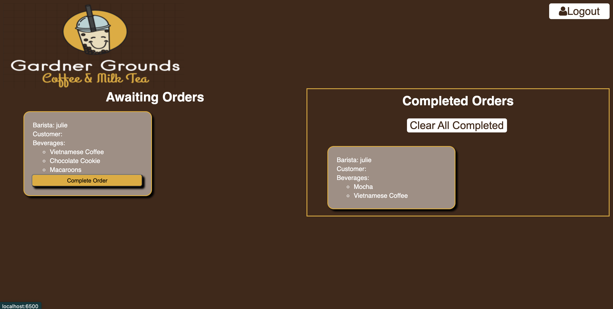

This is a full stack web application of 'Gardner Grounds', a specialty coffee and milk tea shop. The cashier can take the customer's order and sent it to the barista to fulfill. The barista can create and account and login to see which orders are needed to be completed. After finishing the order, they can put it in the completed order queue.

How It's Made: EJS, CSS, JavaSript, Mongo.DB, Node.js and Express.js

Optimizations: 

Lesson Learned: I learned how to use stored data in MongoDB and using EJS to generate HTML markup. 